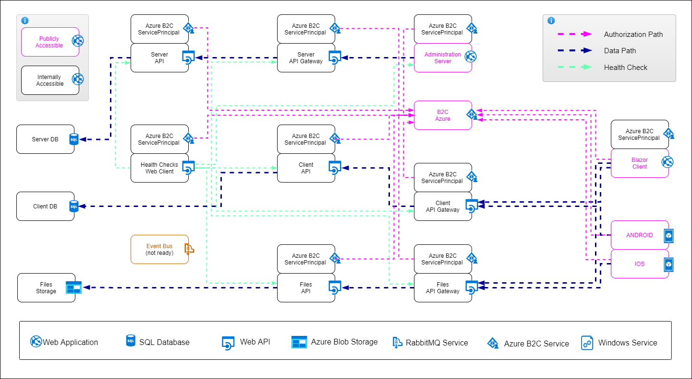

# S2KDesignTemplate

## Getting Started


| Image | Status | 
| ------------- | ------------- | 
| Blazor Web Client | [](https://github.com/s2kdesign-com/WASM_Net5_Azure_B2C_Template/actions/workflows/gh-pages.yml) |

| Nuget | Status | 
| ------------- | ------------- | 
| S2kDesignTemplate.ApiEtensions | [](https://github.com/s2kdesign-com/WASM_Net5_Azure_B2C_Template/actions/workflows/nuget-s2kdesigntemplate-extensions.yml) |

##### Start with Visual Studio and [Docker](https://docs.docker.com/docker-for-windows/install/)
Clone the project and open  `"src/S2kDesignTemplate.sln"`. 
Right click on `"docker-compose"` and choose `"Set as startup"` then press F5.

##### Start with Visual Studio Without [Docker](https://docs.docker.com/docker-for-windows/install/)
Start the projects in this order with right click `"Set as startup"` :
```
S2kDesignTemplate.WebStatus - http://localhost:5107/
S2kDesignTemplate.ServerAPI - http://localhost:44363/
S2kDesignTemplate.Server - http://localhost:44314/
```

##### Start with Command line
Make sure you have [installed](https://docs.docker.com/docker-for-windows/install/) and [configured](https://github.com/dotnet-architecture/eShopOnContainers/wiki/Windows-setup#configure-docker) docker in your environment. After that, you can run the below commands from the **/src/** directory and get started with the `eShopOnContainers` immediately.

```powershell
docker-compose build
docker-compose up
```

You should be able to browse different components of the application by using the below URLs :

```
Web Status (HealthCheck Monitoring) : http://host.docker.internal:5107/

Web Client :  http://host.docker.internal:44314/
Web Client API :  TODO
Web Client Gateway :  TODO

Web Server :  http://host.docker.internal:44314/
Web Server API:  http://host.docker.internal:44363/
Web Server Gateway :  TODO

Web Files API: TOO
Web Files Gateway: TODO

```
>Note: If you are running this application in macOS then use `docker.for.mac.localhost` as DNS name in `.env` file and the above URLs instead of `host.docker.internal`.
---


Start template with preconfigured infrastructure
 


### Nuget Packages:

---
#### Cors Policies
Nuget: "[S2kDesignTemplate.ApiEtensions](https://github.com/s2kdesign-com/WASM_Net5_Azure_B2C_Template/packages/1008690)"

Cors Policies for APIs are configured in `startup.cs` file : 

```c# 
public void ConfigureServices(IServiceCollection services){
    ...
    services.AddCorsExtensions(Configuration.GetSection(nameof(CorsPoliciesConfiguration)).Get<CorsPoliciesConfiguration>());
}
```
```c#
public void Configure(IApplicationBuilder app, IWebHostEnvironment env){
    ...
    app.UseCorsExtensions();
}
```

Add configuration to `appsettings.json` ->
```json
  "CorsPoliciesConfiguration": {
    "CorsPolicies": {
      "0": { "PolicyName": "WebStatus", "Url": "https://localhost:44364", "Enabled": true }
      "1": { "PolicyName": "Admin", "Url": "https://localhost:44365", "Enabled": true }
    }
  },
```
---
#### Swagger UI 
Nuget: "[S2kDesignTemplate.ApiEtensions](https://github.com/s2kdesign-com/WASM_Net5_Azure_B2C_Template/packages/1008690)"

Swagger UI for APIs is configured in `startup.cs` file: 
```c# 
public void ConfigureServices(IServiceCollection services){
    ...
    services.AddControllers();

    services.AddSwaggerExtensions(Configuration.GetSection("SwaggerConfiguration"));
    ...
}
```
```c#
public void Configure(IApplicationBuilder app, IWebHostEnvironment env){   
    app.UseSwaggerExtensions(Configuration.GetSection("SwaggerUIOptions"));
    ...

}
```
Add configuration to `appsettings.json` ->
```json
  "SwaggerConfiguration": {
    "Title" :  "Server API" ,
    "OpenApiOAuthFlow": {
      "AuthorizationUrl": "https://xxx.b2clogin.com/xxx.onmicrosoft.com/xxx/oauth2/v2.0/authorize",
      "TokenUrl": "https://xxx.b2clogin.com/xxx.onmicrosoft.com/oauth2/v2.0/token",
      "Scopes": {
        "ServerAPI.Read": "https://xxx.onmicrosoft.com/xxx/xxx"
      }
    }
  },
  "SwaggerUIOptions": {
    "OAuthConfigObject": {
      "ClientId": "xxx",
      "AppName": "S2KDesignTemplate-SwaggerUI"
    }
```
---
#### Health Checks
Nuget: "[S2kDesignTemplate.ApiEtensions](https://github.com/s2kdesign-com/WASM_Net5_Azure_B2C_Template/packages/1008690)"

HealthChecks for APIs is configured in `startup.cs` file: 
```c# 
public void ConfigureServices(IServiceCollection services){
    services.AddHealthChecksExtensions(Configuration.GetSection("HealthChecksConfiguration"));
    ...
}
```
```c#
public void Configure(IApplicationBuilder app, IWebHostEnvironment env){   
    ...
    app.UseEndpoints(endpoints =>
    {
        endpoints.MapControllers();
        endpoints.MapHealthChecksExtensions();
    });
}
```

If one project is referencing another, Add configuration to `appsettings.json` to master project ->
```json
  "HealthChecksConfiguration": {
    "UrlGroup": {
      "0": {
        "Url": "https://localhost-dependant-project:44363/hc",
        "Name": "server-api-check",
        "Tags": [
          "server-api"
        ]
      }
    }
  },
```